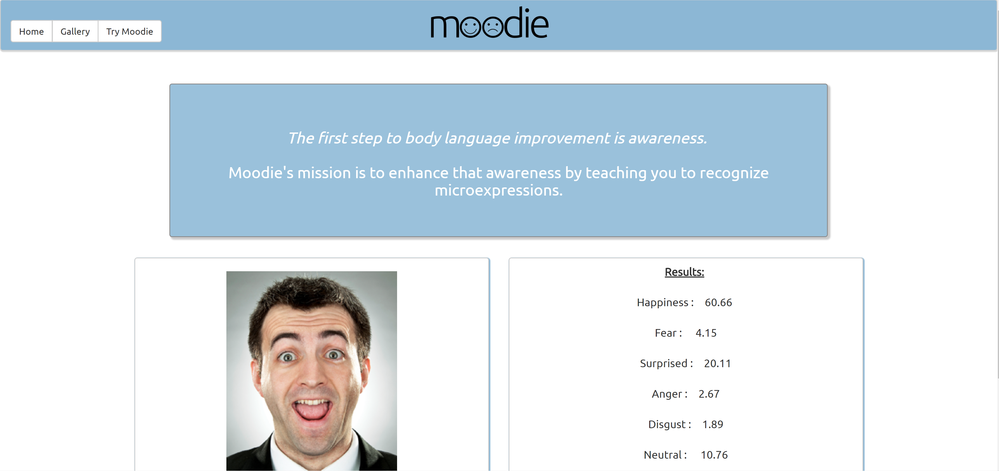

# Moodie
Moodie expression evaluation app

## Team Members
- Tim Holland
- Klayton Liekkio
- Courtney Radford
- Dil Somb

Moodie is a full stack web application built using Node, Express, Handlebars and mySQL using MVC. Moodie uses Face ++ API facial recognition software to analyze photos and display results based on the users facial expressions. Moodie evaluates 7 different micro expressions: Happiness, Sadness, Disgust, Anger, Fear, Neutral and Surpise. 

The web application accesses the users webcam and/or camera phone to let the user take photos of themselves. Moodie will choose a random emotion and the user must try and take a photo of themself making that expression. The user will get results instantly letting them know how closely they matched the chosen expression. 

Users can choose to same their images into a gallery. The gallery is categorized by emotion and the images displayed are shown in order of closest match to least closest match. These images are saved in a mySQL database. 

https://mooodie.herokuapp.com/

